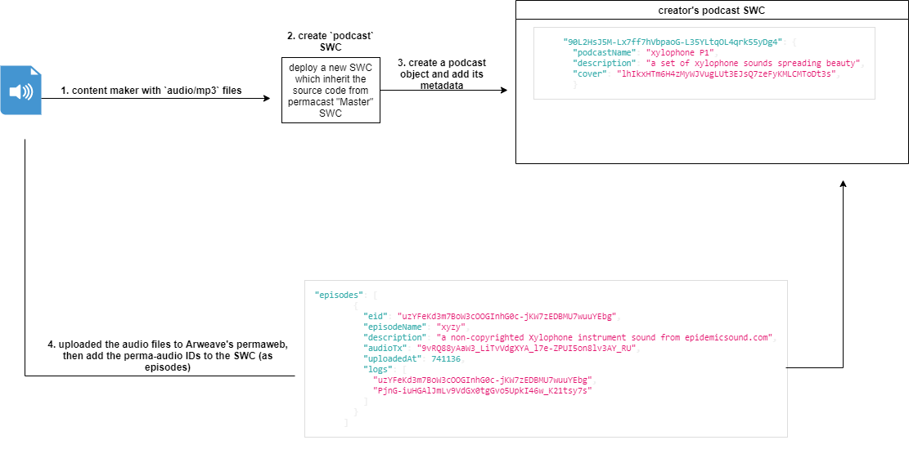

# permacast

Permacast is a podcasting hosting and discovery platform powered by the Arweave Permaweb. Let you podcasts live forever with censorship resistance.

# workflow

Any content creator (podcasts) can use the permacast platform to perma-host his/her podcasts and its episodes. The audio files are permanently archived in Arweave's Permaweb once uploaded to Permacast frontend. 

Each content-creator needs an <a href="https://faucet.arweave.net/">Arweave wallet</a> topped-up with <a href="https://www.coingecko.com/en/coins/arweave">AR tokens</a> to deploy a contract, and start adding episodes.

  

# tech-stack 
- Frontend: React
- backend: SmartWeave contracts

# License

Permacast is licensed under the MIT license

